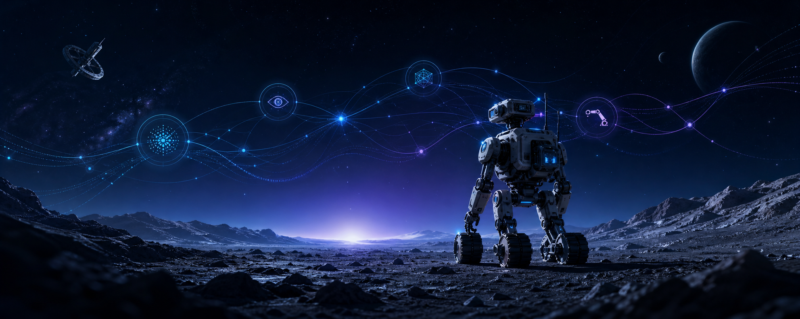

# Hi, I'm Viet Nguyen 👋

### AI Researcher & Engineer

Building intelligent systems with **LLMs, VLMs, VLAs, and AI agents**.

Based in Seoul, South Korea · AI Researcher at Sejong University

---

## About Me

I am an AI researcher and engineer interested in how foundation models can perceive, reason, use tools, and act in real-world environments. My work centers on **multimodal intelligence**, **autonomous agents**, and the systems that turn modern AI models into reliable applications. I am particularly interested in **embodied AI for autonomous exploration**, including its potential in space environments.

I enjoy moving between research and engineering—from exploring new model capabilities to building practical, end-to-end AI systems.

## Research & Engineering Interests

- **Large Language Models (LLMs)** — reasoning, tool use, retrieval, and adaptation
- **Vision-Language Models (VLMs)** — multimodal understanding and visual reasoning
- **Vision-Language-Action Models (VLAs)** — connecting perception and language to action
- **AI Agents** — planning, memory, orchestration, and multi-agent systems
- **Embodied AI** — intelligent systems that interact with simulated and physical environments
- **AI for Space Exploration** — autonomous perception, reasoning, and action in challenging environments

## Tech Stack

### AI & Agentic Systems

### Robotics & Simulation

### Software & Infrastructure

## Current Focus

- 🔭 Researching multimodal and agentic AI systems
- 🧠 Exploring how LLMs and VLMs can plan, reason, and collaborate
- 🤖 Connecting foundation models with embodied agents and robotic systems
- 🚀 Exploring embodied AI for autonomous space systems
- ⚙️ Building reliable AI applications from research prototypes

---

### Let's Connect

I am always interested in thoughtful conversations and collaborations around multimodal AI, intelligent agents, embodied systems, and AI for space exploration.

“A mind needs books like a sword needs a whetstone.” — Tyrion Lannister

